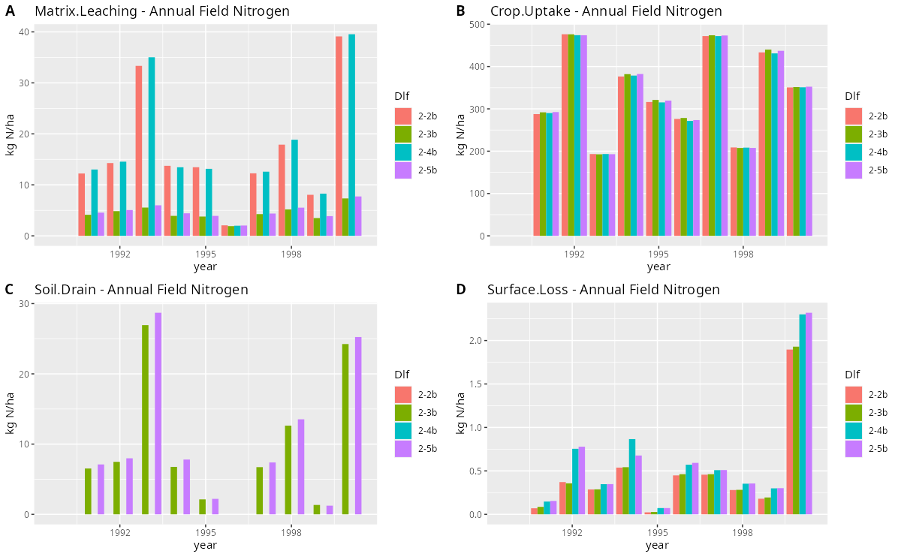

<!-- badges: start -->

<!-- badges: end -->

# daisyrVis
A suite of visualization tools for Daisy log files written in R.

## Installation
`daisyrVis` is currently only available from github. You need Rtools to build the package. If not already installed, you can install it with your package manager or from https://cran.r-project.org. You can then use `devtools` to install `daisyrVis`. Depending on your platform, you might need to install `git`.

First install `devtools`

    install.packages('devtools')

The try to install `daisyrVis`

    devtools::install_git('https://github.com/daisy-model/daisyrVis')

If this fails try to install `git2r`

    install.packages('git2r')

and install `daisyrVis` again

    devtools::install_git('https://github.com/daisy-model/daisyrVis')

If this fails open an issue and describe the problem https://github.com/daisy-model/daisyrVis/issues

You can remove the package with

    remove.packages('daisyrVis')

The contents of the package can be listed with

    library(daisyrVis)
    ls("package:daisyrVis")

## Examples
### Reading dlf files

    library(daisyrVis)
    example(read_dlf)

### Plotting

    library(daisyrVis)
    example(plot_dlf)
    example(animate_dlf)
    example(plot_mass_balance)

The call to `eaxmple(plot_dlf)` should produce a plot similar to this

### Mass balance

    library(daisyrVis)
    example(mass_balance)
    example(mass_balance_summary)

### Utility functions

    library(daisyrVis)
    example(subset_dlf)
    example(daisy_time_to_timestamp)

## Documentation
Use the builtin help for documentation on each function. For a more tutorial like introduction go to https://daisy-model.github.io/daisyrVis/ and browse the available articles.

## Development
Follows https://r-pkgs.org/

Start `R` in base of repository. Then use devtools to load, check and install package

    library(devtools)
    load_all()
    lint()
    check()
    install()
